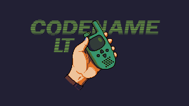
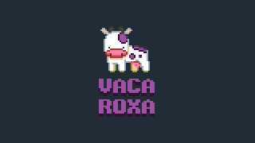

# Codename-LT

A pixelart game where you have to run without getting caught by evil agents. 
This is the product of development with an awesome team of people from the 
[VACAROXA](https://apoia.se/vacaroxa). Find them on 
[twitter looking the Hashtag](https://twitter.com/hashtag/vacaroxa?src=hash)
or follow [@estudiovacaroxa](https://twitter.com/estudiovacaroxa).

Firstly the people involved in the whole project:

[@bakudas](https://twitter.com/bakudas) | [@pcbmani](https://twitter.com/pcbmani) | [@_Gabrielfer](https://twitter.com/_Gabrielfer) | [@MauricioMunky](https://twitter.com/MauricioMunky) | [@DidiGameBoy](https://twitter.com/DidiGameBoy) | [@derekpxart](https://twitter.com/derekpxart) | [@eri0o](https://twitter.com/eri0o) | [@rafaelgiordanno](https://twitter.com/rafaelgiordanno)

## Game Controls

Use **`WASD`** or Arrow keys to move. Use **`K`** or **`space`** as accept button.

**`F11`** or **`Alt+Enter`** gives fullscreen, **`-`** and **`+`** rescale the game window.

Xbox360 USB controls are also supported. Other controls were not tested. 
Android and iOS has experimental touch controls.

## Running

The game is made with Love2d, so after you `git clone` this repository or
download the `.zip`, you can run by going in it's parent folder and running

    love project/

Alternatively, if you just want to play, look into [**releases**](https://github.com/VacaRoxa/CodenameLT/releases) 
or go to the game [**itch.io**](https://bakudas.itch.io/clt) page and download the latest binary.

Note running with the `love` command requires installing [**love2d**](https://love2d.org/)

## Game Code

### Love2d and Lua

**Lua** is a scripting language that is really good at being plugged in existing 
C++ code and exposing it like an API, to offer script functionality: imagine you
built something like Autocad and forgot to build a console to offer advanced 
functionality, Lua is really good for that. I understand that Lua doesn't aim to
enable pure feature complete Lua development.

**Love2d** is a framework for game development. Love2d is not built in Lua, it's
built in C++ with SDL and exposes an API with an attached Lua interpreter. 
Porting your game to a platform, means essentially porting Love2d to that 
platform. 

### The libraries

We can't invent the wheel that many times, so besides using **Love2d** and **Lua**,
libraries were used to ease development.

#### [hump](https://github.com/vrld/hump) 

**hump** was used to provide ***gamestates*** which were used for providing the title screen, 
the credits, the game and the cutscene. 

It's important to notice that each state has no information on the other (unless
using globals), so for example, to switch state, you have to ask the `main.lua`,
a function was built to deal with this.

hump also provided Timers, which was used to prevent an input in dialog boxes
from skipping additional  dialogs. Other tools from hump were not used. The Camera 
is also provided by hump and we attached it to the player sprite.

#### Proxies

One liners were provided to ease Music and Image loading from correponding
assets folder. They are in `main.lua`, and allow stuff like 
`Music.music_name:play()` to happen.

#### [STI](https://github.com/karai17/Simple-Tiled-Implementation) 

A library for loading [**Tiled**](http://www.mapeditor.org/) maps that are 
exported as *.lua* files. Tiled also provides a box2d implementation for physics.
The **box2d** implementation from the latest library was broken or incompatible
with latest Tiled, so a modded one was made on the fly to work, and was how the
collision with walls and characters was made in game.

#### [terebi](https://github.com/oniietzschan/terebi)

All the art is pixel art, this library guarantees everything will be draw pixel
perfect and also gives us nice features like rescalling. So the game provides 
f11 for full screen and + and - for rescalling the main window.

#### [anim8](https://github.com/kikito/anim8)

This library was used to animate the player sprite, the agents sprite and other
sprites.

#### Other libraries

During development, other libraries were added, notably lume.lerp for easing 
the dialog appearance in game. 

### The engine

The images, music and sounds can be just placed in the game folder and directly
be used in game, skipping any import/export workflow. **Tiled** was used as a
level editor. 

#### main.lua

The main code deals with initializing everything (terebi, game states, load 
assets, and push shaders), creates a function to provide access to game states,
set the initial state to the StartScreen and unifies the keyboard and joystick
input in a single interface that can be pooled.

#### Game.lua

The actual game. The `init` function starts the game and sets the level to 1. 
Once each level is loaded, the map is loaded through sti and objects in the 
map are replaced by entities: the `Player` receives the player entity, , the
itemSpawner are removed and the entities are inserted too. All entities 
created are inserted in a table called `sprite_list`, a new layer is created
in the game map, it's draw function is replaced by one to draw the entities
and this layer is then inserted before the foreground layer, allowing for 
everything to be drawn by a single `map:draw()`.

The update function deals with all the game logic: makes the player be 
followed by agents, checks for collision between the player and the items and
the exit point.

#### other files (*.lua)

The cutscene, credits and start screen are really concise and can be easily 
understood by code. A Character entity and Item entity were created to deal 
with those objects: postion, size, animation and direction.

### Using Tiled

  [Tiled](http://www.mapeditor.org/) is the map editor used for this game. 
It can be [downloaded here](https://thorbjorn.itch.io/tiled). Tiled 1.1.1 was
used which was the latest stable when Codename_LT was made, but should be good
with the latest stable available.

After downloading the code, look inside the folder `project/map`. There are 
five `.tmx` files, `level0.tmx` to `level4.tmx`, the game levels. More levels 
can be added by editing `Game.lua` in `project/src/states`.

With Tiled opened, look into layers. If a layer has the custom property with **key**
`collidable` with a value that is a **string**, written `true`, that layer is considered
a collidable, and anything drawn there will be collidable, even if it's *invisible*. 
Use the **ERASER** to erase the tiles instead of painting with transparent tiles. 
Right now, there is only a single collidable layer, and it's called `tileLayerWalls`.

We placed objects in two layers, one is called objDecoracao, to store decoratives, and
other is called objLayer. The engine doesn't care for the layers, it will search all the
map looking for objects that have special things in them:

- An object named `Player`, it will be the player entry point in the map.

- An object named `Exit`, it will be the exit point of the map, to advance to next Level.

- An object named `itemSpawner`, with the custom property `item`. Acceptable values for
item right now are either `radio` or `secret` (the suitcase).

- An object named `ennemySpawner` (with typo TM!) with a custom property id that takes a
numeric value. This will be considered a spawn point for agents, it will be better explained
later on.

- An object with the custom property `type` with string value `trigger`. This is a trigger object.
I will explain below how they work.

#### trigger objects!

A trigger object contain a field called runLuaChain that takes a string text containing a valid
Lua Chain for the engine. 

A simple chain can be of the type:

    Say('This is some text!'),
    Say('Some more text!'),
    closeSay(),
    SpawnEnemy(3)

Much attention to the proper comma on all lines except the last. `SpawnEnemy(number)` spawns enemys
in the spawn points of the same id as the number passed. After a `Say('text')`, a `closeSay()` is needed
to close the text dialog. 

Supported actions right now:

    SpawnEnemy( number_id )
    Say( string_text )
    timedSay( seconds_number , string_text )
    closeSay(  )
    playSound( string_soundName )
    EndGame(  )

If your trigger object runs a Lua Chain ( you can just add a closeSay() if it needs to be empty), you 
can also add a custom property runLuaScript and run pure lua functions. They aren't chained so they will
happen instantly.

**Trigger objects are destroyed when the player activates them!**

## License and Copyright

The font used is [*Verdana2*](http://www.pentacom.jp/pentacom/bitfontmaker2/gallery/?id=278) by Paul Spades.

This code is [`MIT License`](LICENSE) and the music and image graphics are available through [`CC BY 4.0`](COPYRIGHT)

[@bakudas](https://twitter.com/bakudas) | [@pcbmani](https://twitter.com/pcbmani) | [@_Gabrielfer](https://twitter.com/_Gabrielfer) | [@MauricioMunky](https://twitter.com/MauricioMunky) | [@DidiGameBoy](https://twitter.com/DidiGameBoy) | [@derekpxart](https://twitter.com/derekpxart) | [@eri0o](https://twitter.com/eri0o) | [@rafaelgiordanno](https://twitter.com/rafaelgiordanno)

